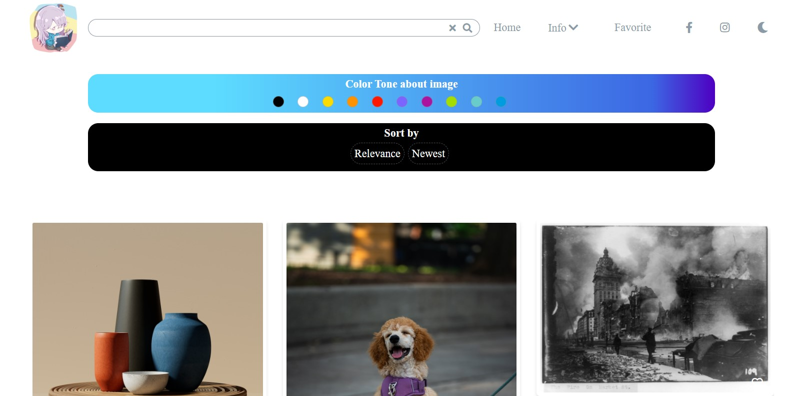
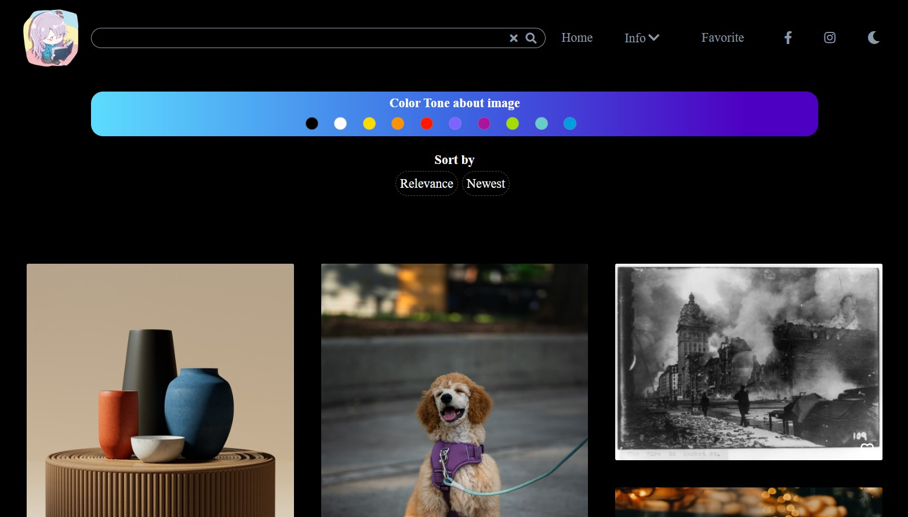

# vue_search_image

## 【介紹】

圖庫，串接 unsplash api，具有搜尋、收藏等功能。
**已佈署 URL：[部署網站試用點此](https://ziwenying.com/vue_search_image/#/homepage)**

- **導覽列：**
  可以切換 dark mode。
- **首頁：**
  1. 進入首頁可隨機取得 30 張圖片，因為是隨機，可能出現重複圖片。
  2. 在「輸入有效關鍵字」的情況下，可使用篩選「圖片色調」和「排序」的功能。
  3. 瀏覽圖片滑到下面會再請求另外 30 張圖片。
  4. 右下角有往上的箭頭，點擊後可回到靠近頂端處。
- **收藏頁：**
  圖片可加入收藏和刪除，並在收藏頁面可看到，最多可以收藏 30 張。
- **關於頁：**
  無特別功能。
- api: https://api.unsplash.com/

#### 【網站版型參考】

- [unsplash](https://unsplash.com/)
- [MG Photography](http://www.maeganguerette.com/)

## 【使用方式】

1. 複製本專案
   git clone https://github.com/ziwenying/vue_search_image.git

2. 移動至專案資料夾
   cd vue_search_image

3. 安裝所需要的套件
   npm install

4. 在本地啟動專案
   npm run serve

5. 打包專案
   npm run build

## 【採用】

1. vue2
2. vuex
3. vue-router
4. axios
5. scss
6. sweetalert2
7. fontawesome
8. date-fns
